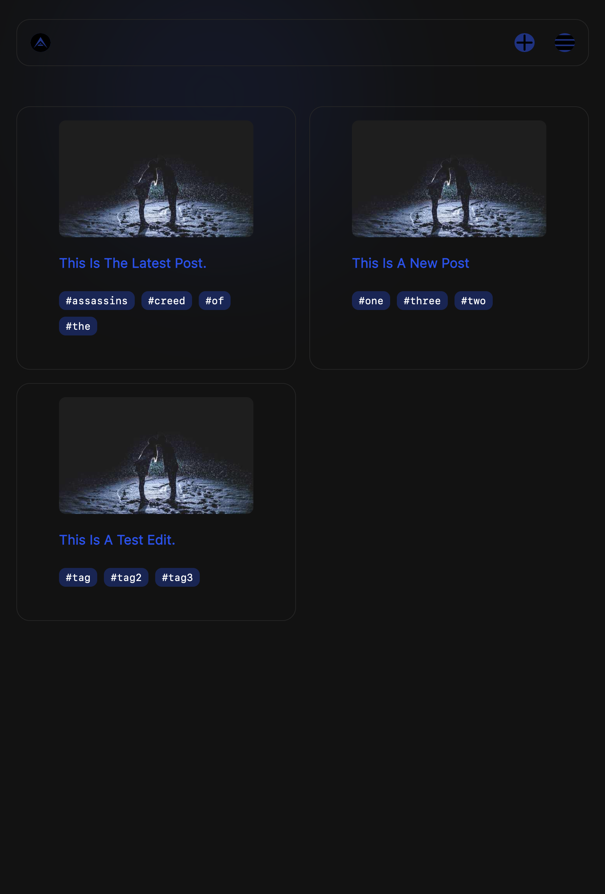
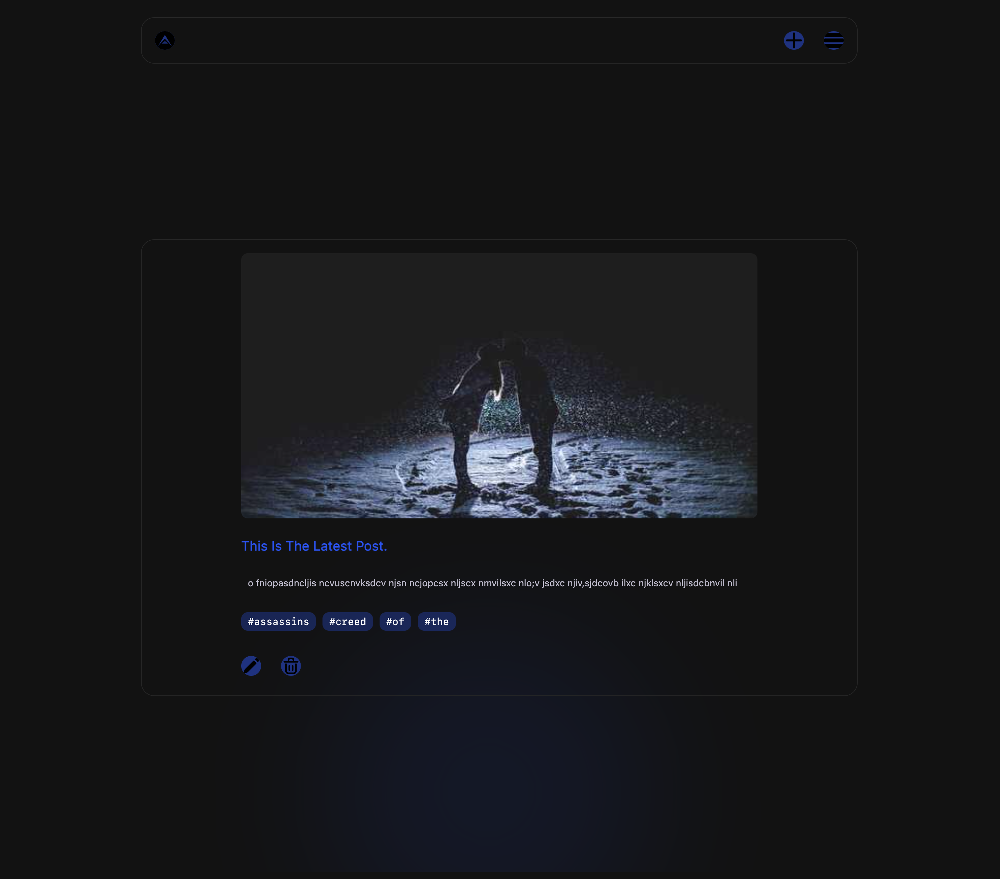
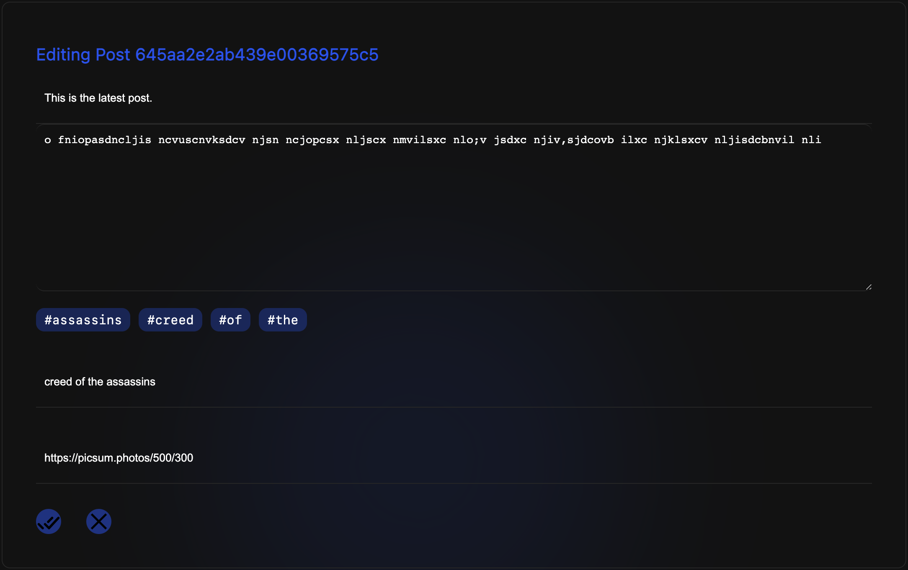
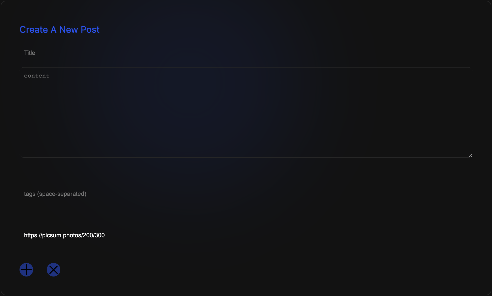

# Redux Platform Frontend

Deployed FrontEnd: [`platform.amitt.ai`](https://platform.amitt.ai)

Deployed API: [`platform-api.amitt.ai`](https://platform-api.amitt.ai)

## What Worked Well

Redux works well, although I still find it a bit of an anti-pattern
compared to other stuff out there (have worked with [Pinia](https://pinia.esm.dev/)
and it's much nicer).

## Screenshots

### Landing Page (Posts) 

### Post Page

### Edit Page

### New Post Page

